# Лабораторная работа 01. Анализ аудио: от волновой формы к признакам ASR

**Выполнила:** Перминова Анастасия, группа M4221

## Параметры признаков, используемые в лабораторной

| Параметр | Значение | Смысл |
|---|---:|---|
| Частота дискретизации | 16 000 Гц | Типичная входная частота для ASR |
| Длина FFT/окна | 400 отсчётов | 25 мс при 16 кГц |
| Шаг окна | 160 отсчётов | 10 мс при 16 кГц, около 100 фреймов/с |
| Mel-полосы | 80 | Типичный размер признаков для нейросетевого ASR |
| Коэффициенты MFCC | 13 | Компактное кепстральное представление |

---

## Часть A. Сгенерированные аудиофайлы

Файлы в `lab_01_ru/data/wav/`:
`clean_speech_like.wav`, `noisy_speech_like.wav`, `reverberant_speech_like.wav`, `clipped_speech_like.wav`, `speed_perturbed_speech_like.wav`.

**1. У какого файла, по вашему ожиданию, будет самая высокая RMS-энергия?**

_Ответ:_ Я думаю, самая высокая RMS-энергия будет у `noisy_speech_like.wav`. Судя по названию, это зашумленный сигнал, а добавление шума должно увеличить общую энергию.

**2. В каком файле искажение волновой формы будет наиболее заметным?**

_Ответ:_ Искажение волновой формы будет наиболее заметным в `clipped_speech_like.wav`. При клиппинге ограничивается амплитуда сигнала: части, превышающие необходимый уровень, обрезаются - это должно быть заметно на графике.

**3. В каком файле спектральные переходы будут наиболее размытыми?**

_Ответ:_ Спектральные переходы будут наиболее размытыми в `reverberant_speech_like.wav`. Это сигнал с реверберацией, а это значит, что звук там "тянется". Новое слово будет накладываться на "отголоски" предыдущего, из-за чего переходы будут более размытыми.

---

## Часть B. Статистика аудио

Данные из `lab_01_ru/outputs/audio_summary.csv`.

| Файл | Длительность | Пиковая амплитуда | RMS | Доля тишины | Доля клиппинга |
|---|---:|---:|---:|---:|---:|
| clean | 5.2 | 0.780029 | 0.250151 | 0.38893 | 2.4e-05 |
| noisy | 5.2 | 0.920013 | 0.265441 | 0.0772 | 1.2e-05 |
| reverberant | 5.2 | 0.880005 | 0.216411 | 0.385096 | 0.000108 |
| clipped | 5.2 | 0.340027 | 0.245213 | 0.29869 | 0.463798 |
| speed perturbed | 4.522 | 0.780029 | 0.250186 | 0.389244 | 1.4e-05 |

**1. У какого файла доля клиппинга ненулевая или необычно высокая? Почему?**

_Ответ:_ Необычно высокая доля клиппинга у `clipped_speech_like.wav`, потому что в названии сказано, что это клиппированный файл, то есть амплитуда там обрезана.

**2. У какого файла самая короткая длительность? Почему?**

_Ответ:_ Самый короткий файл - `speed_perturbed_speech_like.wav`, потому что "speed perturbed" в названии означает "скорость нарушена". Значит, сигнал был ускорен.

**3. Почему доля тишины может быть важна для ASR на длинных записях?**

_Ответ:_ Доля тишины может быть важна для ASR на длинных записях, потому что, если в файле много участков без речи - придется обрабатывать бесполезные секунды. Это впустую тратит вычислительные ресурсы, увеличивает время обработки, и, вероятно, иногда "сбивает с толку" систему и может приводить к неточностям в распознавании.

---

## Часть C. Волновая форма

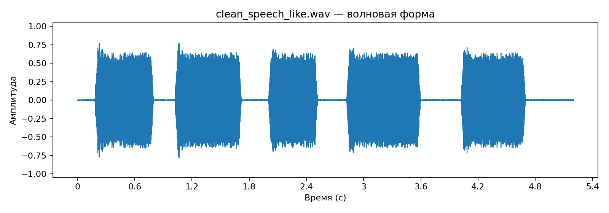
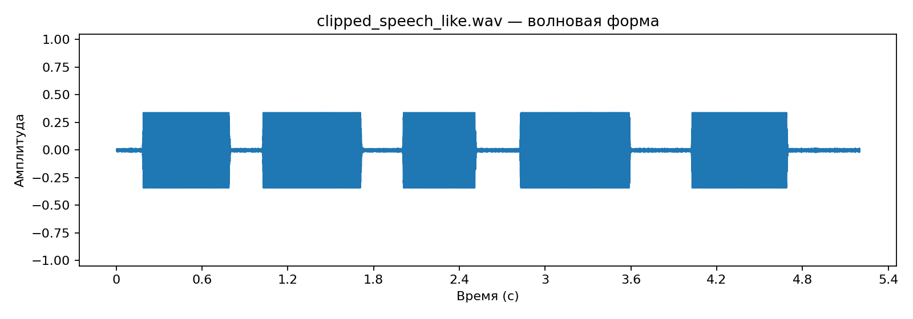
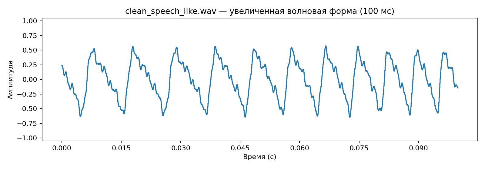
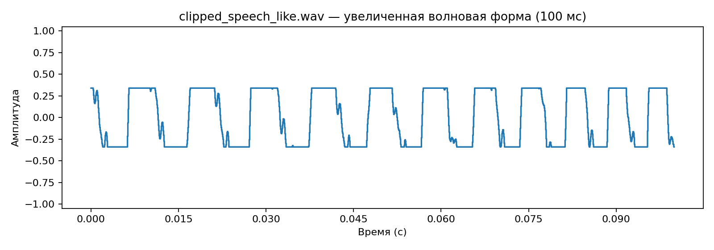

**Обращаем внимание на:**

- огибающую амплитуды;
- паузы;
- плоские клиппированные пики;
- высокоамплитудный шум;
- изменения временного масштаба.

**1. Какое искажение легче всего увидеть на волновой форме?**

_Ответ:_ Сильнее всего заметны срезанные верхняя и нижняя части волны: вместо острых концов появляются плоские участки. Амплитуду урезали до определенного предела.

**2. Как выглядит клиппинг?**

_Ответ:_ При клиппинге пики становятся плоскими. Верх и низ волны срезается.

**3. Почему одной амплитуды может быть недостаточно, чтобы понять содержание речи?**

_Ответ:_ Амплитуда может влиять на громкость, но не может показать, что именно было произнесено. Два разных звука могут иметь одинаковую амплитуду, но звучать совершенно по разному. Это зависит уже от частотных характеристик сигнала, поэтому используются, например, спектрограммы.

---

## Часть D. Лог-спектрограмма STFT

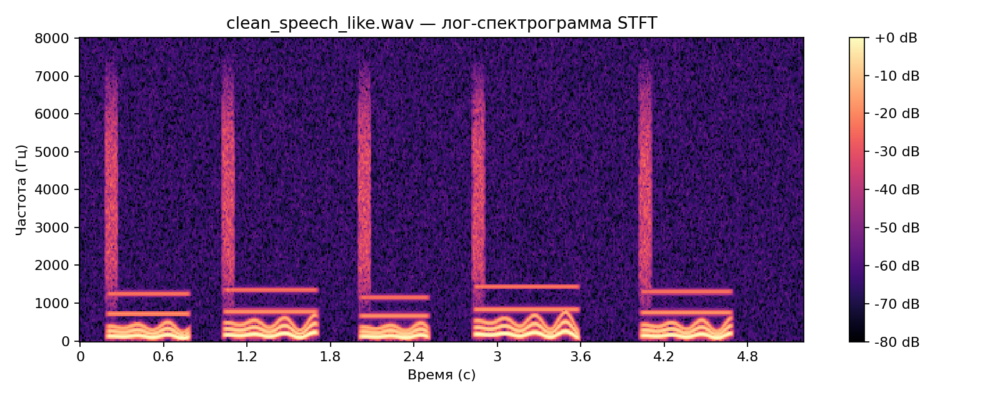
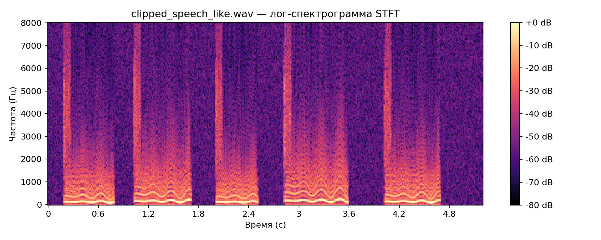
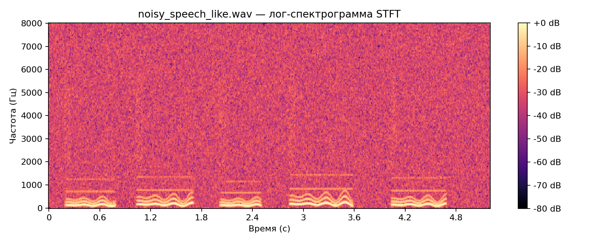
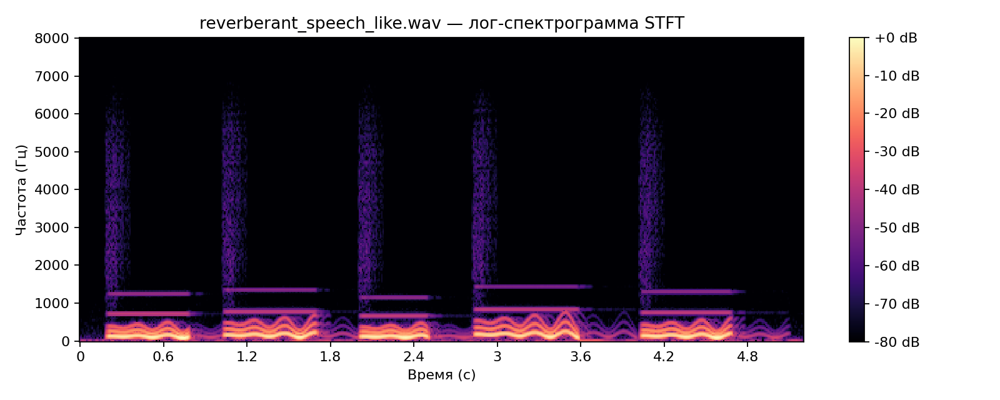
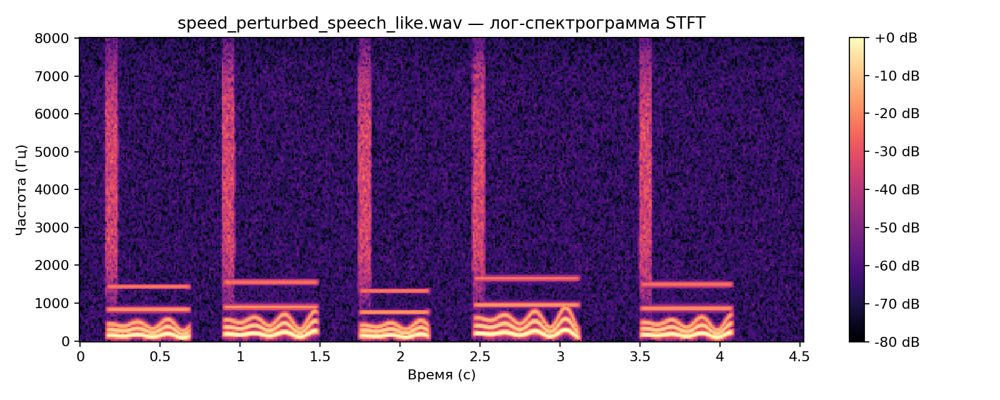

Спектрограмма STFT показывает, как энергия частот меняется во времени.

**Обращаем внимание на:**

- низкочастотную voiced-структуру;
- широкополосный шум;
- вертикальные или размазанные переходы;
- спад энергии после speech-like событий в реверберированном аудио.

**1. В каком файле больше всего широкополосной высокочастотной энергии?**

_Ответ:_ Больше всего широкополосной высокочастотной энергии сосредоточено в `noisy_speech_like.wav`. Судя по всему, в этом файле белый шум - то есть его энергия распределена по всем частотам.

**2. Как реверберация меняет time-frequency паттерн?**

_Ответ:_ В `reverberant_speech_like.wav` звуки растянуты во времени. Линии в низких частотах не обрываются в конце звука, как в clean, а медленно затухают, сливаясь. Вертикальные полосы также становятся более размытыми и тусклыми.

**3. Почему шум может вызывать замены или удаления в ASR?**

_Ответ:_ Шум может мешать распознаванию полезной информации о сигнале. Например, особенно сильно затеряются шипящие звуки. Также в зашумленном сигнале сложно определять паузы, потому что в них слишком много энергии. Модель может принимать шум за речь, путать звуки и пропускать их.

---

## Часть E. Log-Mel-спектрограмма

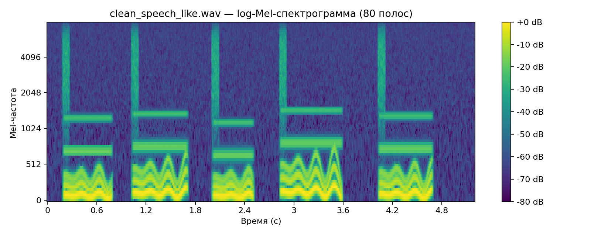
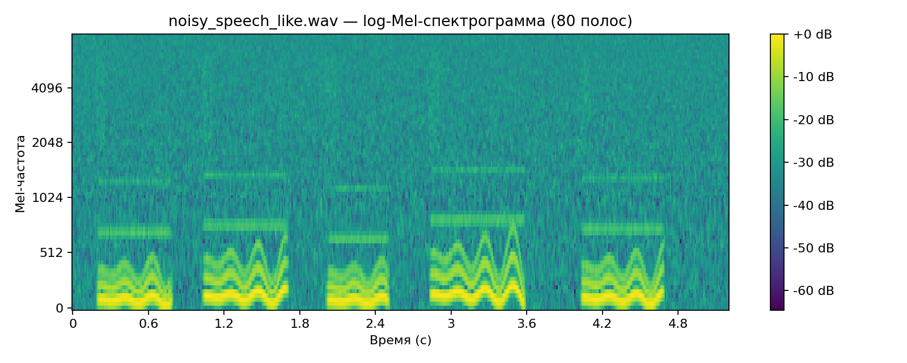
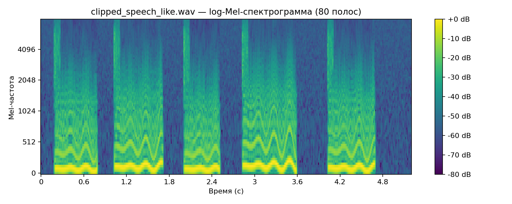
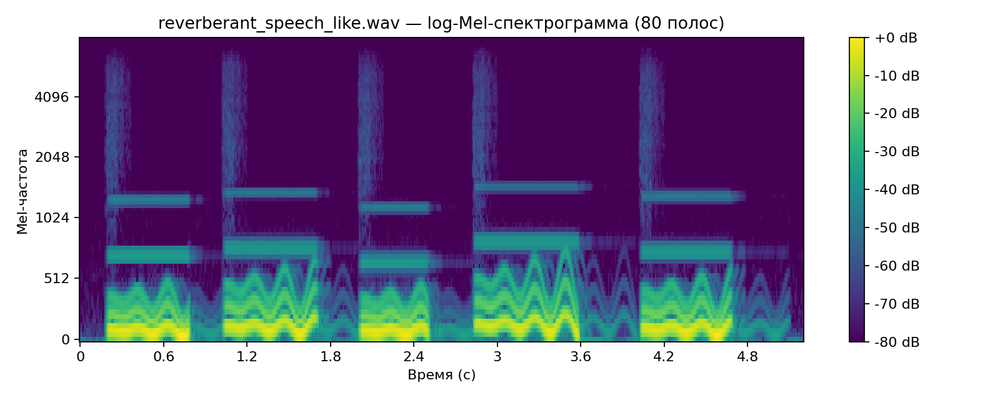

Log-Mel признаки сжимают частотную информацию в перцептивно мотивированные полосы и широко используются в нейросетевом ASR.

**1. Какую информацию легче увидеть на log-Mel, чем на волновой форме?**

_Ответ:_ На log-Mel, в отличие от волновой формы, которая показывает только амплитуду, можно увидеть какие частоты звучат в каждый момент времени. В диапазоне низких частот видны волнистые линии - это основной тон и форманты. Видны горизонтальные полосы выше - это, наверное, гласные, и вертикальная полоса в начале звука - возможно, согласная.

**2. Какая информация теряется или сжимается по сравнению с линейно-частотной STFT?**

_Ответ:_ Теряется частотное разрешение, особенно на высоких частотах. Log-Mel сжимает значения после STFT. Это особенно отражается на вертикальных полосах. На STFT они были четче, а здесь - чем выше, тем тусклее. 

**3. Почему логарифмические энергии полезны для речи?**

_Ответ:_ Логарифмические энергии для речи полезны. потому что у нее большой динамический диапазон. Гласные могут быть намного сильнее согласных, из-за чего последние могут потеряться. В логарифмической шкале видны все звуки. Логарифмическая шкала приближена к человеческому восприятию. Для моделей также проще обучаться на таких данных, потому что диапазон значений более узкий.

---

## Часть F. MFCC

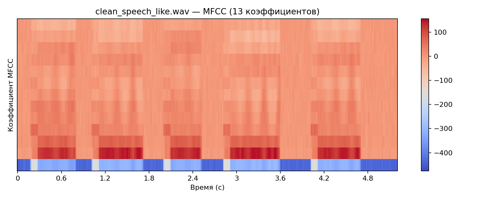
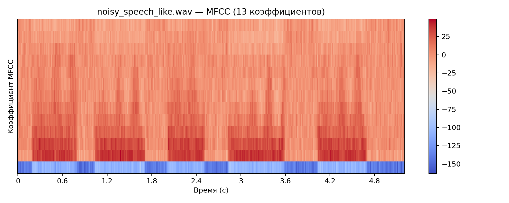
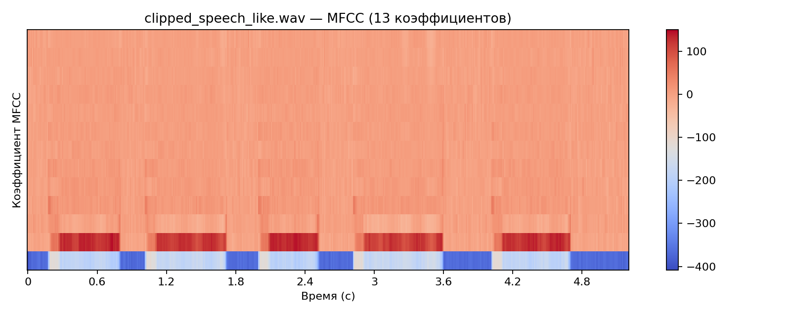
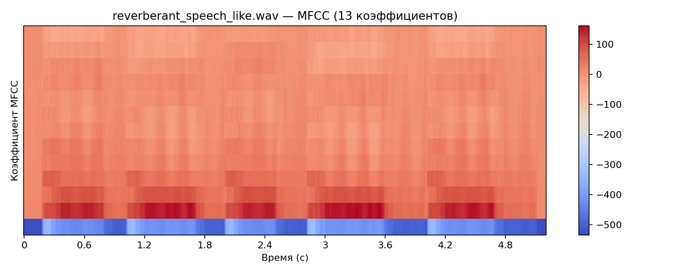
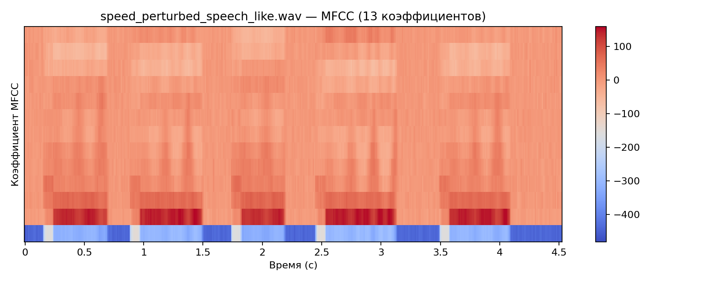

MFCC — компактное представление, исторически важное для классического ASR. Даже если современные системы часто используют log-Mel или обучаемые признаки, MFCC остаются полезными для понимания старых пайплайнов и некоторых диагностик.

**1. Чем визуально графики MFCC отличаются от log-Mel?**

_Ответ:_ На графиках MFCC нет частотной оси. По вертикали здесь - номера коэффициентов (13 штук), каждый из которых описывает форму спектра целиком, а не по одной полосе частот. Здесь не видно основного тона и формант, можно заметить только границы речи. Больше всего информации в первых трех коэффициентах. Различия между файлами все так же прослеживаются, но слабее.

**2. Почему компактное представление может быть полезным?**

_Ответ:_ Компактное представление может быть полезным, так как требует меньше вычислений от модели. Признаки в MFCC менее коррелированные, что может быть удобнее для некоторых моделей. Из-за того, что мелкие детали опускаются, признаки меньше зависят от чего-либо (например, от голоса), что, возможно, полезно для некоторых задач.

**3. Почему современный нейросетевой ASR может предпочитать более богатые log-Mel признаки?**

_Ответ:_ Современные нейросети умеют работать с подробными признаками и извлекать из них нужную информацию, поэтому детали не мешают им, а, напротив, помогают (например, детали могут быть полезны для определения эмоциональной окраски, языков, где важна высота тона, интонирование и т.д.). Из-за того, что признаки log-Mel связаны между собой, модели могут это использовать при обучении.

---

## Часть G. Сравнение чистого и искажённого аудио

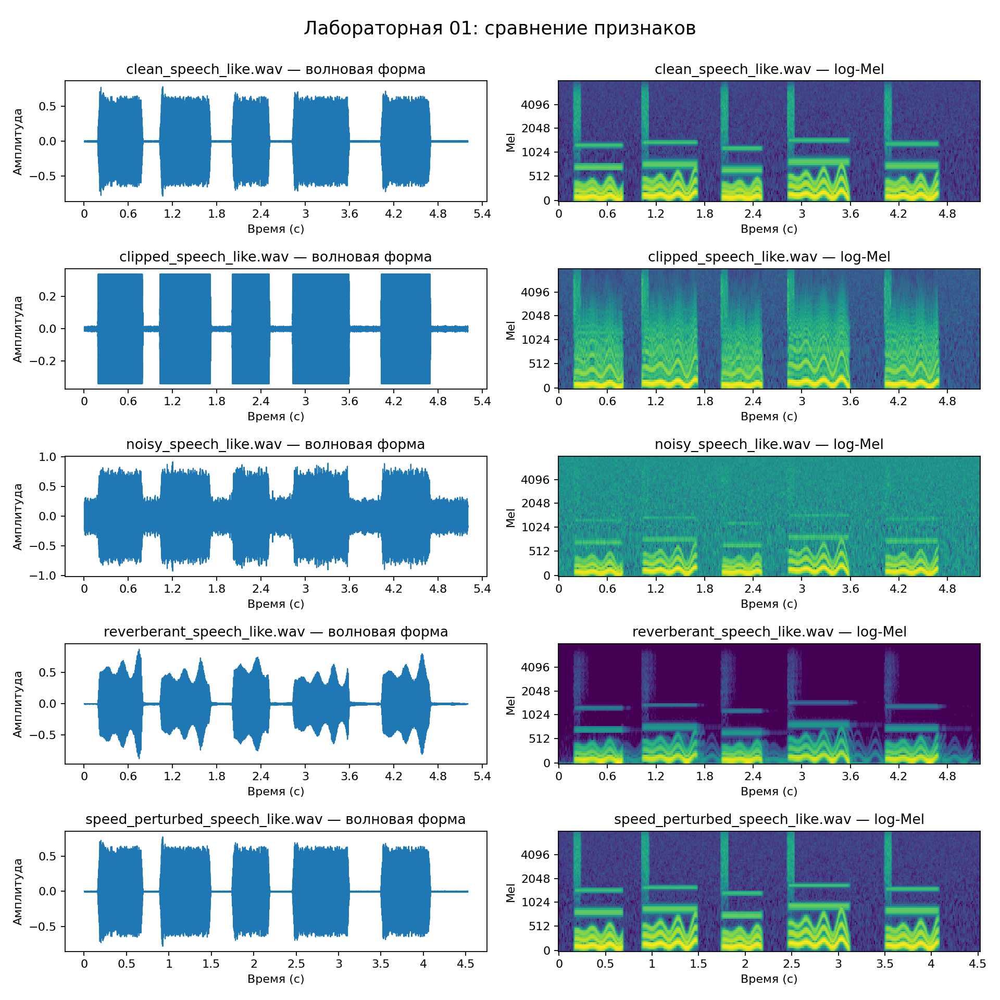

| Искажение | Что изменилось в волновой форме? | Что изменилось в спектрограмме / log-Mel? | Возможный тип ошибки ASR |
|---|---|---|---|
| Шум | Особенно заметно изменение в паузах: вместо ровной линии между звуками постоянный шум. Фрагменты речи также "обросли" лишними деталями. | Фон на всех частотах заполнился "рябью" энергии. Полосы в верхних частотах затерялись. | Удаление и замена. Неправильное определение границ речи, путаница в звуках, шум, принимаемый за речь. |
| Реверберация | Затухающие "хвосты" после сегментов речи, амплитуда скачет. | Звуки "растягиваются" во времени, нет четких пауз, высокие частоты тусклее и более размыты. | Неправильная разметка по времени, определение границ речи, слова могут теряться. Удаление и замена. |
| Клиппинг | Амплитуда ограничена, "срез" сверху и снизу. | Энергия размазалась по высоким частотам, из-за чего затерялась вертикальная линия и форманты. | Искажение звуков, добавление ложных звуков из-за появления энергии в высоких частотах, ухудшение распознавания. Замена. |
| Ускорение | Сегменты и паузы стали короче, запись в целом сжалась по времени. | Сжатое время и сдвиг вверх по частоте. | Короткие звуки или слова могут быть пропущены, ошибки в разметке по времени. Удаление и замена. |

Подсказки по типам ошибок ASR:

- удаление;
- замена;
- вставка;
- неверная временная метка;
- плохое определение границ речи;
- галлюцинация после тишины/шума;
- ухудшение пунктуации/регистра в downstream-обработке.
